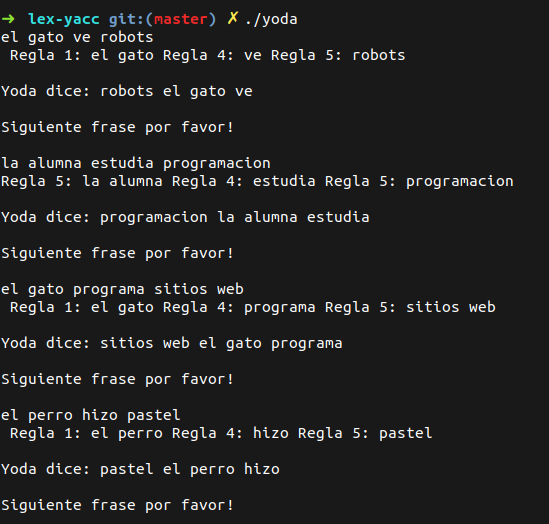

# LENGUAJE YODA

Esta gramática recibe una frase de entrada con la estructura: SVO (Sujeto, Verbo,
Predicado)

```
<frase> ::= <sujeto> <verbo> <objeto>
<sujeto> ::= <artículo> <sustantivo> | La persona
<artículo> ::= el | la | los | las | uno | unos | un | ...
<sustantivo> ::= gato | perro | hombre | mujer | computadora | robot
<verbo> ::= hizo | corrió | comió | programó | enseñó
<objeto> ::= <artículo> <sustantivo> | dos memorias
```

Término Sujeto Verbo Objeto
Normalmente expresado con su abreviatura SVO es un término que se utiliza en la
tipología lingüistica para designar un tipo determinado de lengua teniendo en
cuenta la secuencia no marcada o neutra de una lengua. Es el orden más
frecuente en los idiomas del mundo. El chino mandarín, el español y el inglés
que son los tres idiomas más hablados del mundo presentan dicho orden
gramatical.
Tenemos ordenes como los siguientes:
Sujeto Verbo Objeto (SVO) (por ejemplo, inglés, kiswahili, chino)
Sujeto Objeto Verbo (SOV) (por ejemplo, japonés, persa, latín)
Verbo Sujeto Objeto (VSO) (por ejemplo, galés y árabe)
Verbo Objeto Sujeto (VOS) (por ejemplo, fijio)
Objeto Verbo Sujeto (OVS) (por ejemplo, guarijío)
Objeto Sujeto Verbo (OSV) (no se usa)
La gran mayoría de las lenguas del mundo utilizan SVO o SOV, y un porcentaje
mucho más pequeño, pero significativo, sigue utilizando VSO. Las otras tres
órdenes son excepcionalmente raras, VOS es ligeramente más común que OSV, y
OVS significativamente más rara que los dos órdenes anteriores.

## Ejecución

